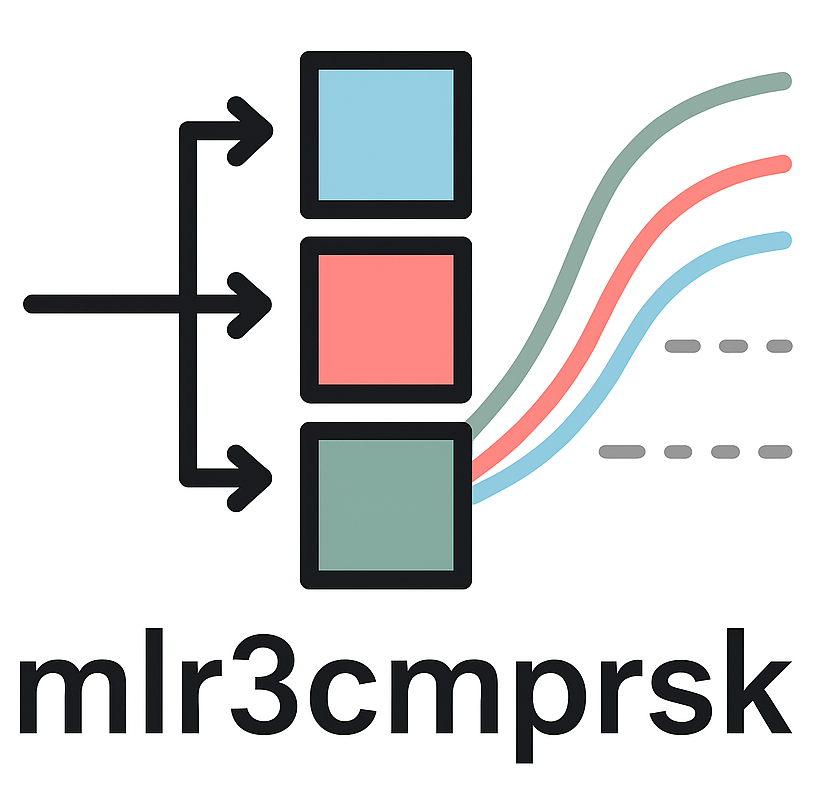

```{r, include = FALSE}
lgr::get_logger("mlr3")$set_threshold("warn")
set.seed(1)
options(datatable.print.class = FALSE, datatable.print.keys = FALSE)
```

# mlr3cmprsk 

 This package is **under development**

Package website: [release](https://mlr3cmprsk.mlr-org.com/)

`mlr3cmprsk` extends the [mlr3](https://mlr3.mlr-org.com/) ecosystem with a unified interface for machine learning in **competing risks survival analysis**.
It provides consistent task, learner, and prediction abstractions, enabling seamless benchmarking, model comparison, and integration with the broader `mlr3` framework.

<!-- badges: start -->
[](https://github.com/mlr-org/mlr3cmprsk/actions/workflows/r-cmd-check.yml)
[](https://cran.r-project.org/package=mlr3cmprsk)
[](https://lmmisld-lmu-stats-slds.srv.mwn.de/mlr_invite/)
<!-- badges: end -->

## Installation

Install the development version from GitHub:

```{r eval = FALSE}
# install.packages("pak")
pak::pak("mlr-org/mlr3cmprsk")
```

## Example

## Code of Conduct

Please note that the mlr3cmprsk project is released with a [Contributor Code of Conduct](https://mlr3cmprsk.mlr-org.com/CODE_OF_CONDUCT.html).
By contributing to this project, you agree to abide by its terms.
